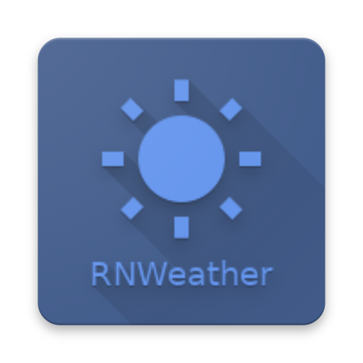
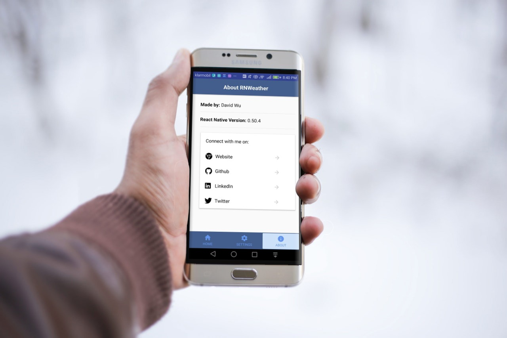
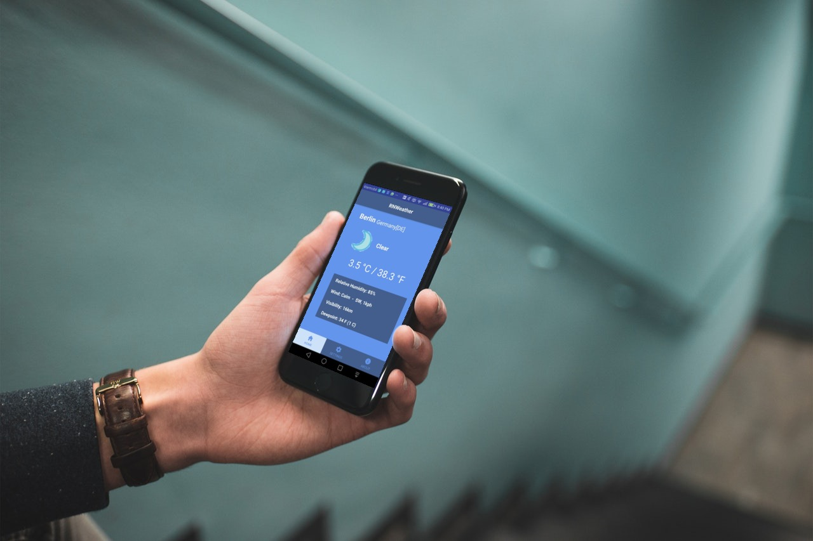

#  RNWeather

#### A Realtime Weather App with customizable location.

## :arrow_up: How to Setup

**Step 1:** git clone this repo:

**Step 2:** cd to the cloned repo:

**Step 3:** Install the Application with `yarn` or `npm i`

## :arrow_forward: How to Run App

1. cd to the repo
2. Run Build for either OS
  * for iOS
    * run `react-native run-ios`
  * for Android
    * Run Genymotion
    * run `react-native run-android`

##  Standard Compliant

This project adheres to Standard.
